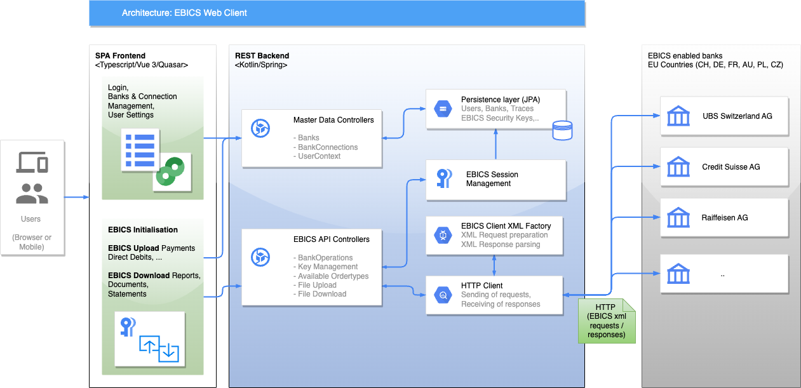
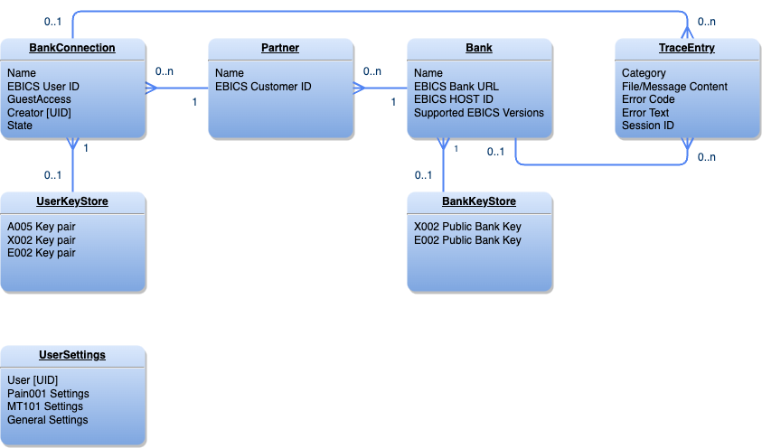

# EBICS Web Client

EBICS Web Client is a web application which is used for exchanging of payments files via EBICS connection with the bank(s) supporting [EBICS protocol](https://www.ebics.de). 
Support of following EBICS versions:
- EBICS 2.5 (H004)
- EBICS 3.0 (H005)

## Installing/running using Docker

Love containers? Don't want to install anything? No problem, use our Docker image.

```shell
docker pull ghcr.io/spaced/ebics-web-client:master
```
run with
```shell
docker run -p 8080:8080 --rm -e SPRING_PROFILES_ACTIVE=dev ghcr.io/spaced/ebics-web-client:master
```
or run with configuration
```shell
docker run -p 8080:8080 -v ./conf:/app/conf -e SPRING_CONFIG_ADDITIONAL_LOCATION=/app/conf ghcr.io/spaced/ebics-web-client:master
```

## Installing/running using maven
build
```shell
mvn install
```
run with
```shell
java -jar ebics-rest-api/target/ebics-rest-api-x.y.z.war
```

---

## Configuration
[Configuration and Logging](ebics-rest-api/README.md)

### HTTPS
Use HTTPS with trusted certificates, don't use HTTP for production setups. Based on the way of running (standalone spring boot or tomcat container) you need to adjust config.properties [spring boot HTTPS config](https://docs.spring.io/spring-boot/how-to/webserver.html) or Apache Tomcat HTTPS


### Architecture & Functionality


The web UI frontend uses REST API backend to execute EBICS orders. The core EBICS API is fork of the Java open source [EBICS java client](https://github.com/uwemaurer/ebics-java-client/) repository.
Thanks a lot for all contributions, otherwise this repo would not be here :-)

Main differences with this fork:

- Web UI (SPA based on Vue3 & Quasar), instead of console client
- REST API exposing EBICS operations
- Support of following EBICS versions 
  - EBICS 2.5 (H004)
  - EBICS 3.0 (H005)
- Added API for HTD & HEV
- Enhanced tracing of EBICS request/response operations, and all content
- Support of bcprov-jdk15on
- Some core API refactored to kotlin in order to increase readability, encapsulation and immutability and consistence
- Added UNIT Tests

#### Security & Authentication
The REST backend application use standard spring security, which is using only sample implementation of in-memory users and HTTP basic authentication. Is up to user to re-implement custom authentication if needed. The following three roles are differentiated:

| Role | Rights |
| --------------- | --------------- |
| ADMIN | Can administer banks & bank connections | 
| USER  | Can create & initialize own & shared bank connection and use them for uploading / downloading | 
| GUEST | Can use the shared "test" bank connections only - for uploading / downloading |

The EBICS user keys are persisted in the DB as java-key-store. User can use additionally the password (2FA) to protect access to his EBICS keys if desired. 

### Data model
The REST backend use simple JPA persistence layer. Access to core EBICS data is protected by Write/Read/UseAccessRightController interfaces which provides granular access control for single records in DB.



### Ideas for roadmap

- Add sub-module (or separate repository) for E2E testing
- Add business content indexing in order to enable displaying of PSR status, HAC status in user-friendly way
- Add connection statistics support 
- Add possibility to sign the existing ebics order without signature, list orders waiting for signature
- Better UNIT Test coverage
- More business friendly Web UI for users which doesn't know anything about EBICS (like classical eBanking UI)
- Implementing UserDetailService to maintain user data  
- Download file indexing in order to find relevant data (like payment status by id, account statement by transaction,..) 
- Replace XMLBeans with JAXB
- Enhance re-usability of the submodules
  - Ensure that ebics-java-lib can be used standalone if needed for other use-cases 
  - Reduce tight coupling between ebics-dbmodel and ebics-rest-api
